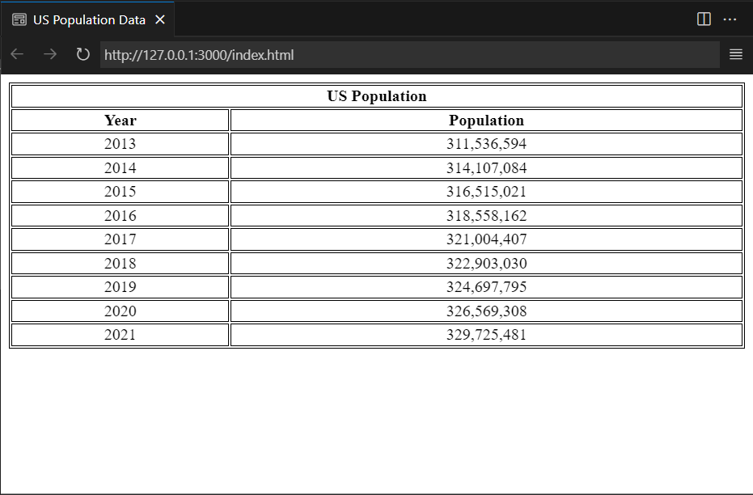

# Assignment 2
An HTML page that displays the US Population data from [Data USA.](https://datausa.io/about/api/)



## Code
- We make an API <code>fetch</code> call to retrieve the data from the following <link>https://datausa.io/api/data?drilldowns=Nation&measures=Population
</link> 

```js
// api url endpoint
const apiUrl = 'https://datausa.io/api/data?drilldowns=Nation&measures=Population';

// Make a GET request to the API endpoint using fetch
fetch(apiUrl)
  .then(response => {
    // check response status and parse json data ...
  })
  .then(data => {
    // iterate over data and add it as rows ... 
  })
  .catch(error => {
    // handle fetch errors ...
  });
```

- The data is then iterated over and added to the table

```js 
for (let i = data['data'].length - 1; i >= 0; i --) {
      // get data for each year
      let year = data['data'][i]['Year'];
      let population = data['data'][i]['Population'];
      let formatted_population = population.toLocaleString('en-US');


      // create and insert row for each year
      const newRow = document.createElement('tr');
      const yearCell = document.createElement('td');
      const populationCell = document.createElement('td');

      // fill the rows with the data
      yearCell.textContent = year;
      populationCell.textContent = formatted_population;
      
      // append row to table
      newRow.appendChild(yearCell);
      newRow.appendChild(populationCell);
      table.appendChild(newRow);
    }  
```